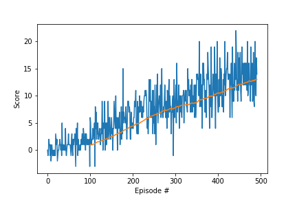

[//]: # (Image References)

[image1]: https://user-images.githubusercontent.com/10624937/42135619-d90f2f28-7d12-11e8-8823-82b970a54d7e.gif "Trained Agent"

# Project 1: Navigation

### Learning Algorithm

In this project used Deep Q-Network (DQN) alorithm with experience replay.

The state space has 37 dimensions and contains the agent's velocity, and actions are 4 (forward, back , turn right and turn left).

Build 2 fully connected layers with 64 nodes and activated with Linear RELU function.

```
State(37) -> FC(64) -> RELU -> FC(64) -> RELU -> Action(4)
```

Used hypere parameters. 
```
lerning rate 0.0001
batch size 64
epsilon decay 0.995
replay buffer size 100000
```

### Rewards 
At Episode 492 reached criteria score.
This is result of score and moving average of 100 episode.



### Idea for Feature work.

More extensions to the DQN algorithm. try to use these for the feature work.

Learning from multi-step bootstrap targets (https://arxiv.org/abs/1602.01783)

Distributional DQN (https://arxiv.org/abs/1707.06887)

Noisy DQN (https://arxiv.org/abs/1706.10295)