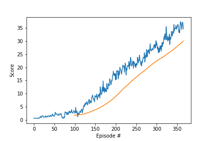

# Project 2: Continuous Control

### Learning Algorithm

In this project uses ``Actor-Critic Methods``, combination of Policy-based and value-based estimation. This methods uses two neural networks to less variance and less biased estimation with faster lerning.

In this project used [Deep Deterministic Policy Gradient (DDPG)](https://arxiv.org/abs/1509.02971) alorithm. DDPG is classified as DQN method for continuous action spaces

The state space has 33 dimensions. Each action is a vector with four numbers, corresponding to torque applicable to two joints.

Here used option2 20 agents enviromnent. Because expected to lern faster than single agent.

Both actor and critic model are built 2 fully connected layers and Linear RELU activate function, 400 and 300 nodes as a hidden layer.

Used hypere parameters. 

Need to try several hyper parametes to have good result.

Buffer is replay buffer size.  this value need to big enough to store memories. each episode generate 20(agents) * 1000(steps).

Lerning rate 1e-4 looks too small to learn so used 1e-3 for actor and critic.

TAU is used how much update from local network to target network. 

LEARN_EVERY parameter uses to wait to lern to controll variance. 

Epsilon and EPSILON_DECAY is important to add noise to explor.

```
BUFFER_SIZE = int(1e6)  # replay buffer size
BATCH_SIZE = 128        # minibatch size
GAMMA = 0.99            # discount factor
TAU = 1e-3              # for soft update of target parameters
LR_ACTOR = 1e-3         # learning rate of the actor 
LR_CRITIC = 1e-3        # learning rate of the critic
WEIGHT_DECAY = 0        # L2 weight decay
LEARN_EVERY = 5          # learn every step
EPSILON = 1.0             # epsilon noise parameter
EPSILON_DECAY = 1e-6       # decay parameter of epsilon
```

### Rewards 
At Episode 266 reached criteria score 30+.
This is result of score and moving average of 100 episode.



### Idea for Feature work.

It's took about 1 hour to train model with GPU. For the feature work reserch and try faster learnig method and hyper parameters.

Also with provided Unity environment I coulnd not run in local osx environment. 

Unity + Deep reenforcement is interesting and extends more ideas. So setup Unity environment from scrach is also feature work.