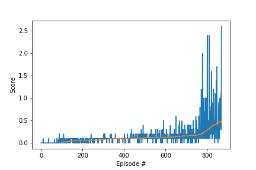

# Project 3: Multi agents Collaboration and Competition

### Learning Algorithm

In this project uses ``Actor-Critic Methods``, combination of Policy-based and value-based estimation. This methods uses two neural networks to less variance and less biased estimation with faster lerning.

In this project used [Deep Deterministic Policy Gradient (DDPG)](https://arxiv.org/abs/1509.02971) alorithm. DDPG is classified as DQN method for continuous action spaces

In this environment, two agents control rackets to bounce a ball over a net. If an agent hits the ball over the net, it receives a reward of +0.1. If an agent lets a ball hit the ground or hits the ball out of bounds, it receives a reward of -0.01. Thus, the goal of each agent is to keep the ball in play.

The observation space consists of 8 variables corresponding to the position and velocity of the ball and racket. Each agent receives its own, local observation. Two continuous actions are available, corresponding to movement toward (or away from) the net, and jumping.

Both actor and critic model are built 2 fully connected layers and Linear RELU activate function, 400 and 300 nodes as a hidden layer.

### Used hypere parameters. 


Buffer is replay buffer size.  this value need to big enough to store memories. 

Lerning rate 1e-4 for actor, 2e-4 for critic.

TAU is used how much update from local network to target network. 

LEARN_EVERY parameter uses to wait to lern to controll variance. 

Epsilon and EPSILON_DECAY is important to add noise to explor.

```
BUFFER_SIZE = int(1e6)  # replay buffer size
BATCH_SIZE = 512        # minibatch size
GAMMA = 0.99            # discount factor
TAU = 1e-1              # for soft update of target parameters
LR_ACTOR = 1e-4         # learning rate of the actor 
LR_CRITIC = 2e-4        # learning rate of the critic
WEIGHT_DECAY = 0        # L2 weight decay
LEARN_EVERY = 2  # learn every step
EPSILON = 1.0             # epsilon noise parameter
EPSILON_DECAY = 1e-6       # decay parameter of epsilon
```

### Rewards 
At Episode 870 reached criteria score 0.5+.
This is result of score and moving average of 100 episode.



### Idea for Feature work.

It's took about 40min to train model with GPU. For the feature work reserch and try faster learnig method and hyper parameters.

Also with provided Unity environment I coulnd not run in the local osx environment. 